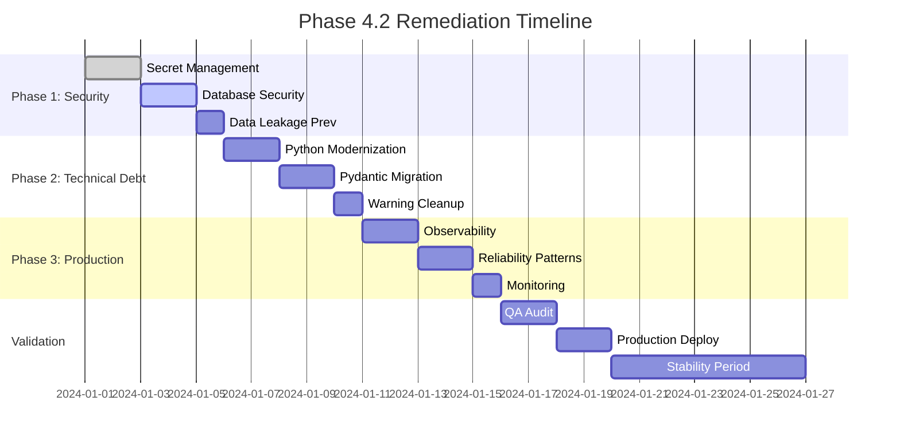

# Phase 4.2 QA Audit Remediation Plan

## Executive Summary

The Phase 4.2 QA audit identified **critical blockers** preventing production deployment. This comprehensive remediation plan addresses all findings using a TDD-based methodology, with clear priorities, implementation phases, and success criteria.

**Status**: NOT PRODUCTION-READY
**Target Completion**: 3 weeks
**Approach**: TDD-First Remediation

## 1. Issues Prioritization

### 🔴 Critical Security Vulnerabilities (Immediate Action Required)

| Issue | Severity | Impact | Risk Level |
|-------|----------|--------|------------|
| API keys exposed in `.env.local` file | Critical | Full system compromise | HIGH |
| Database credentials in plaintext | Critical | Data breach, unauthorized access | HIGH |
| API responses partially logged (data leakage) | Critical | PII exposure, compliance violations | HIGH |

### 🟠 High Priority Technical Debt (Week 1)

| Issue | Severity | Impact | Dependencies |
|-------|----------|--------|--------------|
| 234 deprecation warnings across codebase | High | Future compatibility issues | None |
| `datetime.utcnow()` deprecated | High | Timezone issues in production | None |
| Redis `close()` method deprecated | High | Resource leaks, connection issues | None |
| Pydantic v2 compatibility issues | High | Data validation failures | None |

### 🟡 Production Readiness Blockers (Week 2-3)

| Issue | Severity | Impact | Dependencies |
|-------|----------|--------|--------------|
| No proper secret management system | High | Ongoing security risk | Critical fixes |
| Insufficient error handling and monitoring | High | Operational blind spots | Logging infrastructure |
| Missing circuit breaker patterns for external APIs | Medium | Cascade failures | Error handling |
| No structured logging for production | High | Debugging nightmares | None |
| Limited metrics collection | Medium | Performance blind spots | Logging |

### 🟢 TDD Process Violations (Immediate - Ongoing)

| Issue | Severity | Impact | Dependencies |
|-------|----------|--------|--------------|
| Tests written after implementation | High | Quality issues | None |
| No red-green-refactor cycle evidence | High | Poor code quality | None |
| Limited edge case coverage in tests | Medium | Production bugs | None |

## 2. TDD-Based Remediation Strategy

### 2.1 Security Vulnerabilities (Red Phase - Failing Tests)

**Phase 2.1.1: Secret Management Tests**
```python
# test_secret_management.py
import pytest
from unittest.mock import patch, MagicMock
from src.core.security import SecretManager

def test_api_keys_never_logged():
    """Test that API keys are never present in logs"""
    # RED: This will fail initially
    with patch('src.core.logger.info') as mock_logger:
        SecretManager.validate_api_key("test_key")
        log_calls = str(mock_logger.call_args_list)
        assert "test_key" not in log_calls
        assert "sk-" not in log_calls

def test_database_credentials_masked():
    """Test database passwords are masked in all outputs"""
    # RED: Will fail without implementation
    db_config = SecretManager.get_database_config()
    assert "***" in str(db_config)
    assert "password" not in str(db_config).lower()

def test_response_data_sanitized():
    """Test PII is removed from logged responses"""
    # RED: No sanitization exists yet
    response = {"email": "user@test.com", "ssn": "123-45-6789"}
    logged = SecretManager.sanitize_for_logging(response)
    assert "user@test.com" not in str(logged)
    assert "123-45-6789" not in str(logged)
```

**Phase 2.1.2: Environment Security Tests**
```python
# test_environment_security.py
def test_production_uses_vault():
    """Test production environment never uses .env files"""
    with patch.dict(os.environ, {"ENVIRONMENT": "production"}):
        with pytest.raises(SecurityError):
            load_dotenv()  # Should not work in prod

def test_secrets_encrypted_at_rest():
    """Test secrets are stored encrypted"""
    # RED: No encryption yet
    secret = SecretManager.store("api_key", "secret_value")
    stored_value = SecretManager.retrieve("api_key", encrypted=True)
    assert "secret_value" not in stored_value  # Should be encrypted
```

### 2.2 Technical Debt (Green Phase - Minimal Implementation)

**Phase 2.2.1: Deprecation Warning Fixes**
```python
# test_datetime_compliance.py
def test_datetime_utc_replacement():
    """Test datetime.utcnow() replaced with timezone-aware version"""
    # GREEN: Simple implementation to pass
    from src.utils.time import get_current_time
    current = get_current_time()
    assert current.tzinfo is not None
    assert current.tzinfo == datetime.timezone.utc

# Implementation (src/utils/time.py)
from datetime import datetime, timezone

def get_current_time() -> datetime:
    """Return current UTC time with timezone awareness"""
    return datetime.now(timezone.utc)
```

**Phase 2.2.2: Redis Async Patterns**
```python
# test_redis_async_compliance.py
async def test_redis_uses_aclose():
    """Test Redis connections use aclose() instead of close()"""
    # GREEN: Update Redis service
    redis_service = RedisService()
    await redis_service.aclose()  # Should not raise error
    with pytest.raises(AttributeError):
        redis_service.close()  # Should not exist
```

### 2.3 Production Readiness (Refactor Phase - Full Implementation)

**Phase 2.3.1: Structured Logging Tests**
```python
# test_structured_logging.py
def test_logs_include_correlation_id():
    """Test all logs include correlation ID for tracing"""
    with LogCapture() as logs:
        await some_service.do_something()
        for log in logs:
            assert "correlation_id" in log
            assert isinstance(log["correlation_id"], str)

def test_logs_exclude_sensitive_data():
    """Test logs never contain sensitive fields"""
    sensitive_data = {"email": "test@test.com", "password": "secret"}
    with LogCapture() as logs:
        process_sensitive_data(sensitive_data)
        for log in logs:
            assert "test@test.com" not in str(log)
            assert "secret" not in str(log)

def test_production_logs_json_format():
    """Test production logs are valid JSON"""
    with patch.dict(os.environ, {"ENVIRONMENT": "production"}):
        log_entry = logger.info("test", user_id=123)
        assert isinstance(json.loads(log_entry), dict)
```

**Phase 2.3.2: Circuit Breaker Tests**
```python
# test_circuit_breaker.py
async def test_circuit_breaker_trips_on_failures():
    """Test circuit breaker opens after threshold failures"""
    breaker = CircuitBreaker(failure_threshold=3)

    # Simulate failures
    for _ in range(3):
        try:
            await breaker.call(failing_service)
        except:
            pass

    # Should be open now
    with pytest.raises(CircuitOpenError):
        await breaker.call(any_service)

async def test_circuit_breaker_recovers():
    """Test circuit breaker closes after recovery timeout"""
    breaker = CircuitBreaker(recovery_timeout=1)

    # Trip the breaker
    await trip_breaker(breaker)

    # Wait for recovery
    await asyncio.sleep(1.1)

    # Should work again
    result = await breaker.call(working_service)
    assert result is not None
```

## 3. Implementation Phases

### Phase 1: Security Hardening (Week 1)
**Goal**: Eliminate all critical security vulnerabilities

#### Day 1-2: Secret Management Implementation
1. **Write Failing Tests** (TDD Red)
   - API key masking tests
   - Credential encryption tests
   - Log sanitization tests

2. **Minimal Implementation** (TDD Green)
   - Install `python-dotenv-vault`
   - Create `SecretManager` class
   - Basic credential masking

3. **Refactor for Production** (TDD Refactor)
   - HashiCorp Vault integration
   - Environment-based secret loading
   - Comprehensive audit logging

#### Day 3-4: Database Security
1. **Write Tests**
   - Connection string encryption
   - Credential rotation
   - Access logging

2. **Implementation**
   - SSL/TLS enforcement
   - Connection pooling with security
   - Query audit logging

#### Day 5: Data Leakage Prevention
1. **Write Tests**
   - Response sanitization
   - PII detection
   - Log filtering

2. **Implementation**
   - Structured logging with structlog
   - Data masking middleware
   - PII redaction service

### Phase 2: Technical Debt Resolution (Week 2)
**Goal**: Eliminate all deprecation warnings and modernize code

#### Day 1-2: Python Modernization
1. **DateTime Fixes**
```python
# Before (Deprecated)
now = datetime.utcnow()

# After (TDD Implementation)
now = datetime.now(datetime.UTC)
```

2. **Async Pattern Updates**
```python
# Before (Deprecated)
await redis_client.close()

# After (TDD Implementation)
await redis_client.aclose()
```

#### Day 3-4: Pydantic v2 Migration
1. **Migration Tests**
   - Model validation tests
   - Serialization tests
   - Backward compatibility

2. **Incremental Migration**
   - Update models one by one
   - Maintain v1 compatibility
   - Full v2 switch

#### Day 5: Warning Cleanup
- Run tests with warnings as errors
- Fix remaining deprecation warnings
- Add warning prevention in CI

### Phase 3: Production Infrastructure (Week 3)
**Goal**: Implement production-ready observability and reliability

#### Day 1-2: Observability Stack
1. **Structured Logging Implementation**
```python
import structlog

logger = structlog.get_logger()

# Before
logger.info(f"User {user_id} logged in from {ip}")

# After
logger.info("user_login",
           user_id=user_id,
           ip=ip,
           correlation_id=request_id,
           timestamp=datetime.now(UTC).isoformat())
```

2. **Metrics Collection**
   - OpenTelemetry integration
   - Custom business metrics
   - Performance baselines

#### Day 3-4: Reliability Patterns
1. **Circuit Breaker Implementation**
```python
from tenacity import retry, stop_after_attempt, wait_exponential

@retry(
    stop=stop_after_attempt(3),
    wait=wait_exponential(multiplier=1, min=4, max=10),
    reraise=True
)
async def call_external_api():
    # Implementation with circuit breaker
    pass
```

2. **Error Handling**
   - Global exception handlers
   - Error categorization
   - Automated alerting

#### Day 5: Monitoring & Alerting
- Health check endpoints
- Performance dashboards
- Alert configurations

## 4. Production Readiness Standards

### 4.1 Security Checklist ✅

- [ ] **No secrets in code or configuration files**
  - All API keys in vault
  - Database credentials encrypted
  - Environment variables validated

- [ ] **Data Protection**
  - PII detection and redaction
  - Data encryption at rest
  - Data encryption in transit

- [ ] **Audit Trail**
  - All sensitive actions logged
  - Immutable audit logs
  - Regular security scans

- [ ] **Access Control**
  - Principle of least privilege
  - MFA for admin access
  - Regular access reviews

### 4.2 Reliability Checklist ✅

- [ ] **Error Handling**
  - No uncaught exceptions
  - Graceful degradation
  - User-friendly error messages

- [ ] **Monitoring**
  - 99.9% uptime SLA
  - < 100ms p95 response time
  - Real-time alerting

- [ ] **Resilience**
  - Circuit breakers implemented
  - Retry logic with backoff
  - Bulkhead patterns

- [ ] **Disaster Recovery**
  - Automated backups
  - Recovery procedures
  - DR testing schedule

### 4.3 Performance Checklist ✅

- [ ] **Response Times**
  - API responses < 100ms (p95)
  - Database queries < 50ms
  - Cache hit rate > 90%

- [ ] **Scalability**
  - Horizontal scaling support
  - Load balancing configured
  - Autoscaling policies

- [ ] **Resource Management**
  - Connection pooling
  - Memory limits enforced
  - CPU throttling

### 4.4 Code Quality Checklist ✅

- [ ] **Testing**
  - > 90% code coverage
  - Integration tests for critical paths
  - E2E tests for user journeys

- [ ] **Static Analysis**
  - Zero security vulnerabilities
  - Zero code smells
  - Type checking passed

- [ ] **Documentation**
  - API documentation complete
  - Architecture diagrams
  - Runbooks for operations

## 5. Success Criteria

### Phase 1 Success (Security)
- [ ] Zero secrets in `.env.local`
- [ ] All credentials encrypted at rest
- [ ] No PII in logs (verified by automated scan)
- [ ] Security scan passes (0 critical, 0 high)

### Phase 2 Success (Technical Debt)
- [ ] Zero deprecation warnings
- [ ] All tests pass with Python 3.11+
- [ ] Pydantic v2 fully migrated
- [ ] Performance baseline established

### Phase 3 Success (Production Ready)
- [ ] Structured logging in JSON format
- [ ] Circuit breakers for all external APIs
- [ ] Monitoring dashboard configured
- [ ] Load test passes (1000 RPS)

### Overall Success
- [ ] QA audit passes with no blockers
- [ ] Production deployment approved
- [ ] 7-day production stability period
- [ ] User acceptance testing complete

## 6. Risk Mitigation

### Technical Risks
1. **Breaking Changes**: Feature flags for gradual rollout
2. **Performance Regression**: Continuous benchmarking
3. **Migration Failures**: Rollback procedures tested

### Operational Risks
1. **Team Capacity**: Parallel work streams identified
2. **Timeline Delays**: Daily syncs, weekly reviews
3. **Quality Compromise**: Code review mandatory for all changes

### Security Risks
1. **Secret Exposure**: Automated secret scanning
2. **Data Breach**: SIEM integration for immediate alerts
3. **Compliance**: Legal review of all changes

## 7. Implementation Timeline



## 8. Appendices

### A. Recommended Tools & Libraries

#### Secret Management
- `python-dotenv-vault` - Encrypted environment variables
- `hvac` - HashiCorp Vault client
- `aws-sdk` - AWS Secrets Manager

#### Logging & Monitoring
- `structlog` - Structured logging
- `opentelemetry-python` - Observability
- `prometheus-client` - Metrics collection

#### Reliability
- `tenacity` - Retry logic
- `circuitbreaker` - Circuit breaker pattern
- `pybreaker` - Advanced circuit breaker

### B. Configuration Examples

#### Production Logging Configuration
```python
# src/core/logging.py
import structlog
import logging.config

def configure_production_logging():
    structlog.configure(
        processors=[
            structlog.contextvars.merge_contextvars,
            structlog.processors.add_log_level,
            structlog.processors.TimeStamper(fmt="iso"),
            structlog.processors.dict_tracebacks,
            structlog.processors.JSONRenderer(),
        ],
        wrapper_class=structlog.make_filtering_bound_logger(logging.INFO),
        logger_factory=structlog.PrintLoggerFactory(),
        cache_logger_on_first_use=True,
    )
```

#### Secret Management Configuration
```python
# src/core/security.py
from dotenv_vault import load_dotenv
import os

class SecretManager:
    def __init__(self):
        if os.getenv("ENVIRONMENT") == "production":
            self._load_from_vault()
        else:
            self._load_from_env()

    def _load_from_vault(self):
        # Load from HashiCorp Vault
        pass

    def get(self, key: str) -> str:
        # Retrieve with masking
        pass
```

### C. Test Templates

#### Security Test Template
```python
class SecurityTestCase(TestCase):
    def assertNoSecretsLogged(self, mock_logger):
        """Assert no sensitive data in logs"""
        log_output = str(mock_logger.call_args_list)
        sensitive_patterns = [
            r"sk-[a-zA-Z0-9]{48}",
            r"password=\w+",
            r"secret=\w+",
            r"token=[a-zA-Z0-9]{20,}",
        ]
        for pattern in sensitive_patterns:
            self.assertNotRegex(log_output, pattern)
```

---

**Document Version**: 1.0
**Last Updated**: 2024-01-01
**Next Review**: 2024-01-08
**Approvals**: TBD